# Integrating GraphRAG with Ontological Reasoning in MaaS Architectures

In AI-driven investment analysis, bridging structured frameworks with unstructured data is critical. Ontological Reasoning provides an expert-curated blueprint (like GICS sectors) to prevent hallucination. GraphRAG (Retrieval-Augmented Generation via Knowledge Graphs) provides a dynamic, data-driven map built directly from raw text.

Here is how combining them elevates the Deep Research Agent.

---

## Architecture Comparison

### Standard Layered RAG (Current)
Relies on vector embeddings for semantic similarity. It excels at direct queries but can miss complex, multi-hop relationships (e.g., hidden cross-investments).

```mermaid
flowchart LR
    A[Playwright Crawlers] --> B[Vector Embeddings]
    B --> C[(OpenSearch)]
    D[User Query] --> E{Semantic Search}
    C -.-> E
    E --> F[LangGraph Agent]
    F --> G[AWS Bedrock]
    G --> H[Final Memo]
    
    style C fill:#0f172a,stroke:#38bdf8
    style G fill:#0f172a,stroke:#a855f7
```

**Limitations:** Retrieval might miss interconnections (e.g., a16z's shared investments across competitors), leading to incomplete synthesis. If the query requires aggregating relationships, it could hallucinate or require multiple refinement loops, increasing latency.

### GraphRAG Integration
GraphRAG acts as a "graph layer" on top of standard RAG. It extracts entities and relationships offline, clusters them into communities, and generates summaries for holistic reasoning.

```mermaid
flowchart TD
    subgraph Offline Indexing
        A[Raw Text] --> B[Extract Entities and Edges]
        B --> C[Leiden Clustering]
        C --> D[(Knowledge Graph and Summaries)]
    end
    
    subgraph Runtime Query
        E[User Query] --> F{Intent Classifier}
        F -->|Semantic| G[Vector DB]
        F -->|Relational| H[Graph Traversal]
        G --> I[Augmented Context]
        H & D --> I
        I --> J[LLM Generation]
    end

    style D fill:#0f172a,stroke:#10b981
    style H fill:#1e293b,stroke:#10b981
```

---

## The xAI Example: Why GraphRAG Matters

Let's assume the Deep Research Agent has crawled and extracted the following raw text snippets via Playwright:

- **Document 1 (News Article):** "xAI raised \$6B in Series B funding led by Valor Equity Partners and Vy Capital. Investors include Andreessen Horowitz and Sequoia Capital. The round values xAI at \$24B post-money."
- **Document 2 (Company Profile):** "xAI, founded by Elon Musk in 2023, focuses on AI for scientific discovery. Competitors include OpenAI and Anthropic. Key partnership: Integration with Tesla for autonomous driving data."
- **Document 3 (Investor Bio):** "Andreessen Horowitz (a16z) is a VC firm with \$35B AUM. Recent investments: xAI (\$500M), OpenAI (\$1B). Focus areas: AI, biotech. Partner: Ben Horowitz."
- **Document 4 (Market Report):** "AI sector saw \$50B in VC funding in 2023. Risks: Regulatory scrutiny from FTC on AI monopolies. Opportunities: Enterprise adoption in healthcare."

**Output Example (Without GraphRAG):**
> "xAI raised \$6B from Valor and others, valued at \$24B. Competitors: OpenAI, Anthropic. Risks: Regulatory scrutiny."

*Limitations Here:* Retrieval missed the critical interconnections between a16z, xAI, and OpenAI due to strict cosine similarity filtering out connected documents.

**Output Example (With GraphRAG):**
> "xAI raised \$6B in Series B from Valor Equity Partners (lead), Vy Capital, Andreessen Horowitz (\$500M), and Sequoia, valuing it at \$24B. Shared investors like a16z (also in OpenAI) suggest portfolio synergies for risk diversification. Competitors: OpenAI and Anthropic, with overlapping focuses on advanced AI. Partnerships: Tesla integration for data. Risks: FTC regulatory scrutiny on AI monopolies, amid \$50B sector funding in 2023."

*Why Better:* It captures relationships (e.g., a16z's cross-investments) that layered RAG might miss, leading to richer, more grounded memos.

---

## How GraphRAG Supports Our Ontology

GraphRAG is not a replacement; it is a dynamic enrichment layer providing hybrid efficiency.

1. **Automated Schema Evolution (Data Ingestion):** GraphRAG identifies emerging niche clusters automatically (e.g., "AI for Climate Tech") directly from news, actively reducing the 18-month human-curated burden.
2. **Solving Sparse Data:** For early-stage startups with no public financial footprint, GraphRAG infers proxies by traversing deeply connected sibling entities.
3. **Factuality & Audit Trails (Eval Node):** By feeding the graph structure directly into the LangGraph "Memo Evaluator", claims can be verified against explicit graph edges. This cuts LLM refinement loops from 3-5 iterations to 1-2, reducing latency by up to 30%.

**The Bottom Line:** Ontological reasoning provides the strict investment framework; GraphRAG provides a continuously updating map of reality. Together, they form a web-scale Deep Research Agent.

---

## Further Enhancements for Institutional Investing

If implementing GraphRAG, consider pairing it with these specialized strategies to fully resolve MaaS friction points:

### 1. Augmenting the "Deep Research Agent" with Temporal RAG
**The Problem:** In institutional investing, time is critical. Standard vector search (Cosine Similarity) over OpenSearch might retrieve a highly semantically relevant article from 2021 stating a company's valuation is \$1B, ignoring a less semantically dense article from 2024 stating it went bankrupt. 

**The Solution:** Implement Time-Aware Retrieval.
- **How:** Add a metadata filtering step in OpenSearch before the vector search, or apply a "time-decay" function to the retrieval scores where newer documents get a recency boost.
- **Why:** Ensures the LangGraph agents are grounding their memos in the absolute latest facts, preventing embarrassing hallucinations about outdated financials.

### 2. Direct Preference Optimization (DPO) for the "Automated Template Builder"
**The Problem:** Prompting an LLM to follow a specific investing firm's "tone" and "rubric" requires massive prompts and constant refinement loops. 

**The Solution:** Move from Prompt Engineering to Preference Alignment (DPO) for hosted/private LLMs.
- **How:** Collect historical data mapping the `[Original LLM Draft]` versus the `[Final Memo Edited by Human Analyst]`. Use this as accepted/rejected pairs to run DPO on an open-weights model.
- **Why:** The model learns the exact institutional tone, formatting preferences, and analytical rigor natively. This reduces the number of times the "Memo Evaluator" has to kick the draft back for refinement, reducing overall latency.
